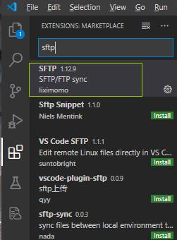
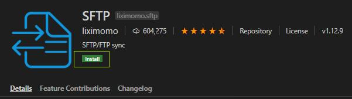
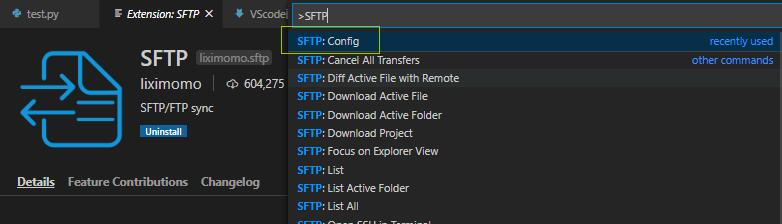
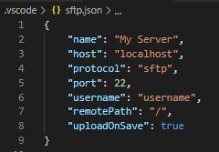
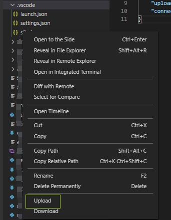

## 点击左侧Extensions(快捷键Ctrl+Shift+x) 搜索SFTP并安装





## 安装后Ctrl+Shift+p 输入SFTP:Config 进行配置




## 初始配置:



```
{
    "name": "服务器名称",
    "host": "localhost",
    "protocol": "文件传输协议sftp/ftp",
    "port": 22,
    "username": "管理员用户名",
    "password": "设置过后每次upload无需输入密码"
    "remotePath": "远程文件路径 不推荐放在主目录",
    "uploadOnSave": true
}
```


## 实例:

```
{
    "name": "server",
    "host": "10.1.1.11",
    "port": 11,
    "protocol": "sftp",
    "username": "usamido",
    "password": "********",
    "remotePath": "/home/usamido/crawler",
    "uploadOnSave": true ,
}
```

## 如果出现超时无响应 添加 connectTimeout 即可

```
{
    "name": "server",
    "host": "10.1.1.11",
    "port": 11,
    "protocol": "sftp",
    "username": "usamido",
    "password": "********",
    "remotePath": "/home/usamido/crawler",
    "uploadOnSave": true ,
    "connectTimeout": 10000
}
```

## 左侧文件栏中 右键点击文件名 选择upload



## 左下角显示成功

